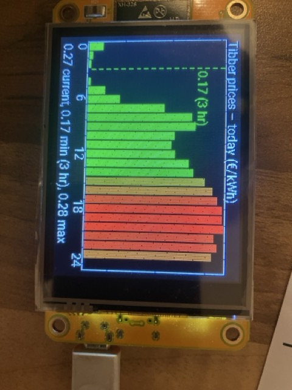
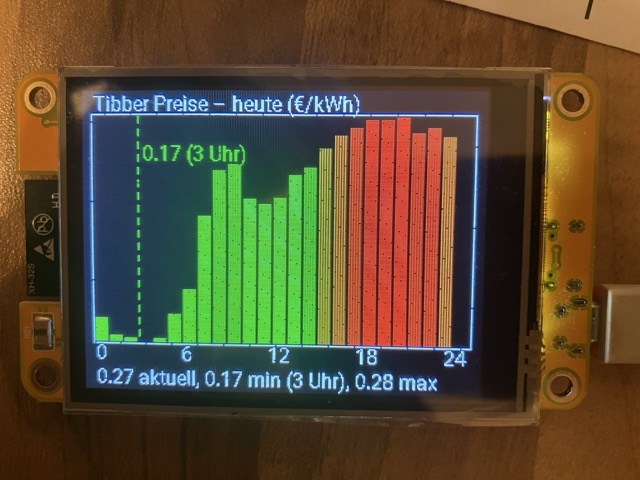
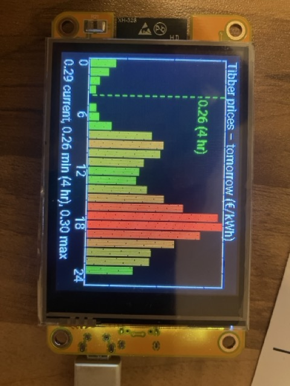

# Display Tibber @ Cheap Yellow Display 
Displays todays & tomorrows tibber prices in a Cheap Yellow Display (CYD) that can be placed anywhere at home.

## Images 

* Todays view with lowest price 0,17 eur at 3 am (dotted line): 
  


* Todays view, with same data, but localized - German language:
   


* By touching the display - showing tomorrows price, lowest price 0,26 € at 4 am (dotted line)



## Features

* Displays Tibber prices for today & tomorrow in a bar char
* Coloring: 0..25 ct: green, above: red scale 
* Touch to switch between todays & tomorrows prices 
* Shows cheapest price with line indicator and hour of day
* Supports Web Interface
* Supports Update of newer versions via OTA 
* Supports I18n (DE/EN) 
  
# Prerequesites

* Get the Cheap Yellow Display (2,8 inch with touchscreen, usb c + micro usb connector) from [Aliexpress](https://s.click.aliexpress.com/e/_c3Roj6sL) 

* Get a Tibber Account: https://tibber.com and from the deveoper / api space, note down your personal tibber token. 
   
* Set up esphome https://esphome.io/ 

* Checkout any free licenced font, e.g. ]https://github.com/googlefonts/RobotoMono into a directory witin this project, called `fonts`. It will require only on font file called `Roboto-Regular.ttf`

* Now, power on the CYD, check the IP address on your wifi router. Note this IP.

* The type of the CYD is(`CYD ESP32 Bruce 2432S028`


# Configuration 

## Secrets: 
* Edit `secrets_example.yaml` with your wifi credentials and rename it to `secrets.yaml`. It should look like this: 

    ```
    wifi_ssid: "ReplacemeWifi"
    wifi_password: "SecretPassword123"
    ```    
    Please set the credentials of your wifi router to connect the CYD to it.

## Display language 
* Edit `tibberdisplay.yaml` search for for `strings` and switch to german if you like to change the language and currency. 

## Set Tibber token
* This project needs your *tibber token* to run. Please fetch it from your tibber account via developer tools. You *can* provide this token initially via `strings_<language>.yaml` - this will build it and allows a quick init, or set this token later on via web ui. 

* Browse to `<IP of you device>>:80` enter your *tibber token* in the form field at the left bottom, press enter or leave the field to save it in your CYD.

* After a 5 minutes, the displa should display the tibber graph.

# Build & Deploy 

* (*optional*) Within this cloned github repository, you can do a `esphome compile tibberdisplay.yaml` to just compile the application. If this works, do the next step to verify all is set up.

## USB Cable

* Within this cloned github repository, do a `esphome run tibberdisplay.yaml --device=/dev/cu.SLAB_USBtoUART` to build & deploy the tibber application onto your device via USB to serial connection. This device name differes between unix, mac and windows.

## OTA (over the air update)
* Also, if you do a `esphome run tibberdisplay.yaml --device=<<IP of you device>>` to build & deploy the tibber application onto your device via over-the air.


# Testing & Debugging 

## ESP Home Cli
More infos about the ESPHome CLI: https://esphome.io/guides/cli/

## Testing your Tibber Token in the console :
The token is a Header Parameter that is used in the Authorization HTTP Header.
To test your Tibber Auth token, please check it on the console :

```
curl \
 -H "Authorization: Bearer <YOUR_TIBBER_TOKEN>" \
 -H "Content-Type: application/json" \
 -X POST \
 -d  ' {"query":"{ viewer { homes { currentSubscription { priceInfo { today { startsAt total }  } } } } }"}' https://api.tibber.com/v1-beta/gql 
```

This should return HTTP 200 valid json.

## Showin the JSON Response in the Web UI

The web ui also displays the Json Response in the field Tibber Json Response to watch what the CYD got responded. There should be a valid json in it.

## Refresh time

The refresh time is set to 5 minutes and can be configured in `strings_en.yml`. 

# Support me 

Support me: https://ko-fi.com/zerwuff